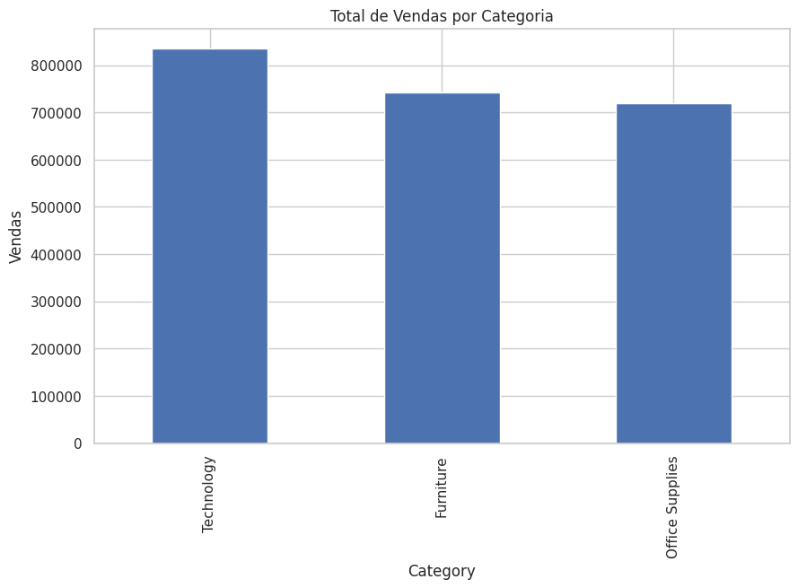
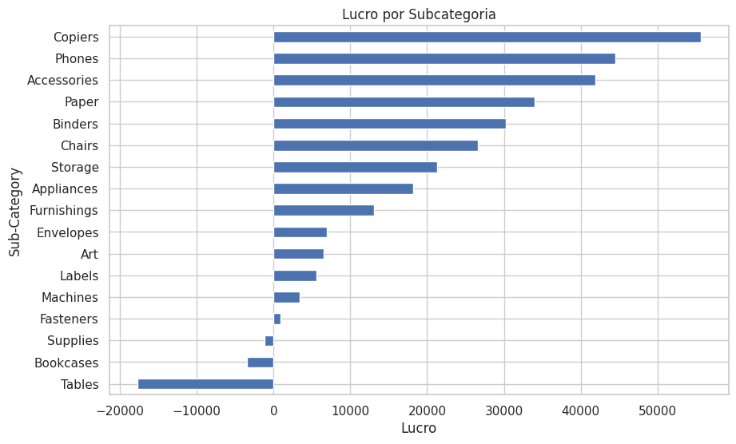
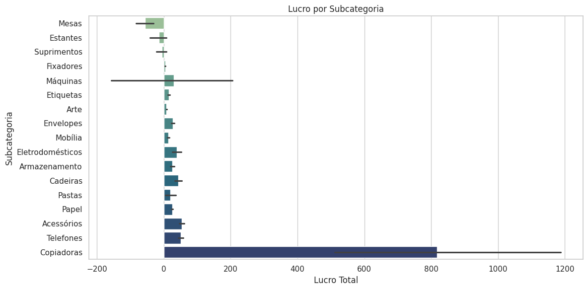
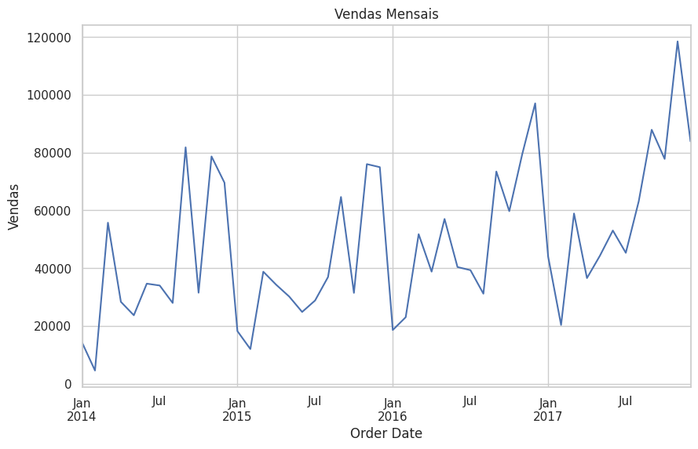
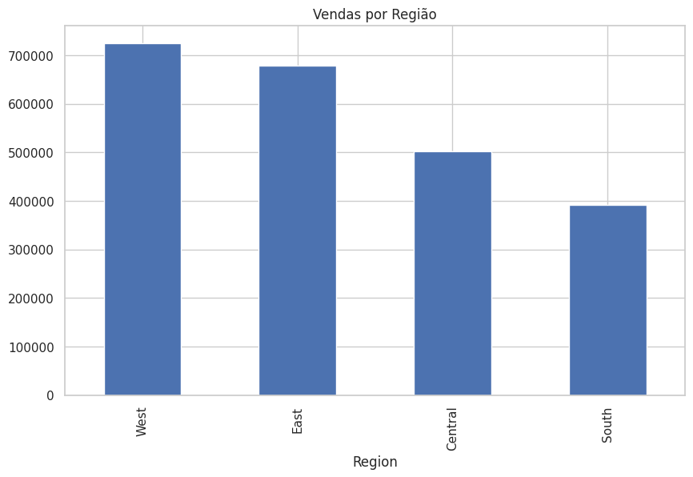
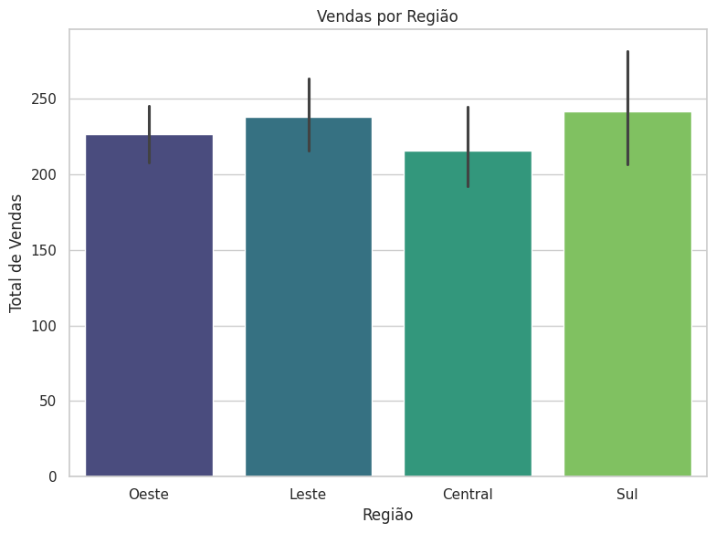

# 📊 Análise de Dados - Superstore

Este projeto é uma análise exploratória de dados (EDA) com foco em vendas, lucros e desempenho por região, baseada no dataset Superstore.

## 🔍 Objetivos

- Analisar lucros por subcategoria
- Identificar sazonalidade das vendas mensais
- Comparar vendas por região

## 📁 Dados

O dataset utilizado é uma versão do "Superstore", com informações sobre vendas, lucros, categorias, datas, regiões e mais.

## 📈 Principais Análises

### Total de Vendas por Categoria 
Gráficos de barras destacando as categorias com maiores volumes de vendas.

### ✅ Lucro por Subcategoria
Gráfico de barras mostrando quais subcategorias são mais e menos lucrativas.

### 📅 Vendas Mensais
Visualização da tendência de vendas ao longo do tempo.

### 🌍 Vendas por Região
Comparação das vendas nas regiões: Sul, Norte, Leste e Central.

## 🌐 Tradução dos Gráficos

Alguns gráficos possuem versões traduzidas para o português, facilitando a compreensão dos dados para falantes da língua.

## 🛠️ Ferramentas Utilizadas

- Python
- Pandas
- Matplotlib
- Seaborn
- Google Colab

*Este é um projeto para fins educacionais e de portfólio.*
